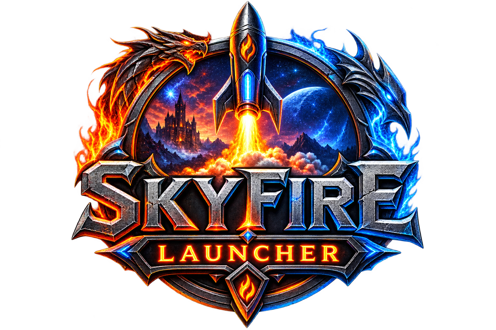

<p align="center">
  
</p>

# SkyFire Launcher

SkyFire Launcher is a desktop client (C#/WPF on Windows, Avalonia on Linux)
for connecting to a
[Project SkyFire](https://github.com/ProjectSkyfire) World of Warcraft: Mists of
Pandaria (5.4.8) private server. Its goal is to let players connect with a
completely **unpatched, retail-original client** — no permanently modified game
files, no hosts-file edits, no manual configuration.

Instead of patching files on disk, the launcher starts the WoW client normally
and applies its changes directly to the running process in memory:

- Redirects the client's login/realm connection to the server address configured
  in the launcher, by hooking the client's own DNS resolution.
- Applies a small set of targeted in-memory patches to the client's login flow
  so it authenticates against a classic realmlist-based authserver (like
  SkyFire's) instead of routing through the modern Battle.net/Agent protocol.
- Leaves the client executable on disk untouched. Every change is undone the
  moment the process exits.

Support for pre-patched clients, and eventually a Battle.net-protocol-compatible
server, is planned.

## Status

Early and actively evolving alongside the rest of the SkyFire project. Expect
rough edges.

## Getting Started

### Installer

Download and run `SkyFireLauncherSetup.msi` from the latest
[release](https://github.com/ProjectSkyfire/launcher/releases). It installs
SkyFire Launcher (self-contained, no separate .NET install required) with a
Start Menu shortcut and a standard uninstaller entry.

### From source

1. Build the solution:
   ```
   dotnet build SkyFireLauncher.slnx
   ```
2. Launch `SkyFireLauncher.exe` from the `Build` output folder.
3. On the **Configuration** tab, set your WoW 5.4.8 client folder, default
   client architecture (32 or 64-bit), and the login address of the SkyFire
   server you want to connect to.
4. On the **Launch** tab, pick a version and click **Launch**.

### Linux

The Linux build is a direct Avalonia port of the same launcher GUI. It writes
the same `Config.wtf` values and applies the same in-memory client patches,
launching `Wow.exe` / `Wow-64.exe` through [Proton](https://github.com/ValveSoftware/Proton)
(recommended) or [Wine](https://www.winehq.org/).

1. Install the .NET 10 SDK, a 5.4.8 client, and either:
   - Steam Proton or [Proton-GE](https://github.com/GloriousEggroll/proton-ge-custom)
     (optional: [umu-launcher](https://github.com/Open-Wine-Components/umu-launcher)), or
   - Wine, if you prefer that runtime.
2. Build and run:
   ```
   dotnet build src/SkyFireLauncher.Linux/SkyFireLauncher.Linux.csproj
   dotnet run --project src/SkyFireLauncher.Linux/SkyFireLauncher.Linux.csproj
   ```
   Self-contained Linux binary:
   ```
   dotnet publish src/SkyFireLauncher.Linux/SkyFireLauncher.Linux.csproj -c Release -r linux-x64 --self-contained
   ```
3. In **Configuration**, point **Client Location** at the folder that contains
   `Wow.exe` / `Wow-64.exe`, and pick **Proton** or **Wine**. Proton versions
   are detected from Steam and `compatibilitytools.d`. Leave **Proton Prefix**
   empty to use `~/.local/share/SkyFireLauncher/proton`.

The Linux launcher needs permission to attach to the Wine/Proton process
(`ptrace`) so it can apply the same in-memory patches as on Windows. That
works when the launcher is the same user that owns the game process and
`kernel.yama.ptrace_scope` is `0` or `1` (the default on most distros).
Config is stored at `~/.config/SkyFireLauncher/config.json`.

#### Arch Linux

You need four things: the .NET 10 SDK, a 5.4.8 client tree, Proton (or Wine),
and the launcher pointed at `Wow.exe` / `Wow-64.exe`.

1. Packages:
   ```
   sudo pacman -S git dotnet-sdk-10.0 steam vulkan-icd-loader
   ```
   Also install the Vulkan ICD for your GPU (`nvidia-utils`, `vulkan-radeon`,
   or `vulkan-intel`). Proton is the default runtime — install Steam, log in
   once, and enable a Proton version under Steam → Settings → Compatibility
   (Proton 9 or Experimental is fine). Optional:
   ```
   sudo pacman -S umu-launcher
   ```
   Proton-GE is also detected from `~/.steam/root/compatibilitytools.d` or
   `~/.local/share/Steam/compatibilitytools.d`.

   Wine only if you do not want Proton:
   ```
   sudo pacman -S wine
   ```
   32-bit `Wow.exe` also needs `[multilib]` plus `lib32-vulkan-icd-loader`
   and the matching `lib32-` GPU package. `Wow-64.exe` is the smoother option.

2. Put an unpatched 5.4.8 client on disk. The folder you select in the
   launcher must contain `Wow.exe` and/or `Wow-64.exe`, for example
   `~/games/wow-548/`. Copy it from Windows, or reuse a prefix path if the
   client already lives under Steam/Proton.

3. Build and run:
   ```
   cd launcher
   dotnet --list-sdks    # need a 10.x SDK
   dotnet run --project src/SkyFireLauncher.Linux/SkyFireLauncher.Linux.csproj
   ```
   Or publish a self-contained binary:
   ```
   dotnet publish src/SkyFireLauncher.Linux/SkyFireLauncher.Linux.csproj -c Release -r linux-x64 --self-contained
   ./Build/linux/Release/linux-x64/publish/SkyFireLauncher
   ```

4. In **Configuration**:
   - **Client Location** — the folder with `Wow.exe` / `Wow-64.exe`
   - **Default Version** — 64-bit if you have `Wow-64.exe`
   - **Login Address** — your SkyFire auth IP
   - **Compatibility** — Proton
   - **Proton Version** — should list Steam/GE installs
   - Leave **Proton Prefix** empty unless you already have one (default:
     `~/.local/share/SkyFireLauncher/proton`)
   - Save, then **PLAY**

   The first Proton start can take a while while it creates the prefix.
   If the selected Proton has no DXVK and `umu-launcher` is installed, the
   launcher may download GE-Proton on first PLAY (can take several minutes).

If **PLAY** fails:

- Prefer **GE-Proton** or Steam **Proton 9/Experimental** (or
  `proton-cachyos-native`). Avoid `*-slr` / Steam Linux Runtime builds — they
  run in a container and block the launcher's in-memory patches (`ptrace`)
- Empty Proton list — install Steam Proton (or GE) and reopen Configuration
- `ptrace` / “could not attach” — do not use `*-slr` Proton; same user as the
  game; `kernel.yama.ptrace_scope` is `0` or `1`
  (`cat /proc/sys/kernel/yama/ptrace_scope`)
- Black screen / no Vulkan — missing GPU ICD, or 32-bit Wow without lib32
  Vulkan
- `d3d9.dll` / `libvkd3d` / “exited immediately” / “No DXVK d3d9.dll” —
  your Proton build may not ship host-side DXVK (common with
  `proton-cachyos-native`). Install system DXVK, then delete the prefix:
  ```
  sudo pacman -S dxvk-mingw-git
  rm -rf ~/.local/share/SkyFireLauncher/proton
  ```
  Or install **GE-Proton** / Steam Proton 9+ and select it in Configuration.
  With `umu-launcher` installed, the launcher can auto-download GE-Proton when
  the selected Proton has no DXVK. Details:
  `~/.local/share/SkyFireLauncher/proton/skyfire-launch.log`
- Client starts but logs into retail/Battle.net — the in-memory patch did
  not land; check the status line under PLAY

### Building the installer

Requires the [WiX Toolset](https://wixtoolset.org/) CLI:
```
dotnet tool install --global wix --version 5.0.2
wix extension add -g WixToolset.UI.wixext/5.0.2
```
Then, from the `installer` folder:
```
./build.ps1
```
Produces `installer\bin\x64\Release\SkyFireLauncherSetup.msi`.

## License

See [LICENSE](LICENSE).
